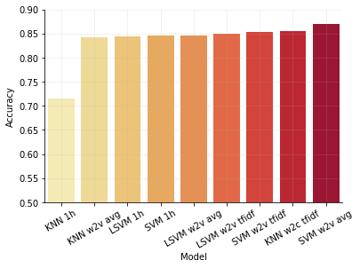
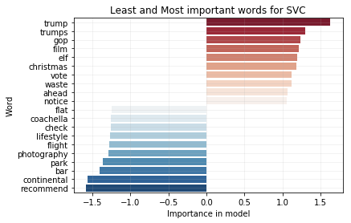

# Russian Twitter Troll Detection

This project aims to detect and identify Russian troll tweets from a dataset of tweets collected during the 2016 US Election period. Using machine learning techniques including SVM, KNN, and Natural Language Processing methods, we create classifiers that can distinguish between normal tweets and those created by Russian trolls.

## Dataset

The dataset comes from a collection of Russian troll tweets released by Twitter as part of the House Intelligence Committee investigation into how Russia may have influenced the 2016 US Election. The dataset contains tweets from accounts believed to be connected to Russia's Internet Research Agency, a company known for operating social media troll accounts.

Dataset source: [Russian Troll Tweets on Kaggle](https://www.kaggle.com/datasets/vikasg/russian-troll-tweets?select=users.csv)

The dataset consists of:
- Russian troll user accounts information
- Russian troll tweets
- Normal tweets for comparison

## Preprocessing

Our data preprocessing pipeline includes:
- Cleaning and normalizing tweet text
- Removing emojis, punctuation, URLs, and special characters
- Extracting hashtags and mentions
- Handling missing values

## Feature Engineering

We implemented three different NLP approaches for feature extraction:
1. One-hot encoding of text
2. Word2Vec with simple averaging of word embeddings
3. Word2Vec with TF-IDF weighted averaging

## Models

We trained and evaluated the following models:
- K-Nearest Neighbors (KNN)
- Support Vector Machine (SVM) with various kernels
- Linear Support Vector Classification (LinearSVC)

Each model was trained using different feature extraction methods and optimized through grid search cross-validation.

## Results

Our best performing model achieved over 80% accuracy in distinguishing between troll and normal tweets. We found that models using Word2Vec with TF-IDF weighting generally performed better than simple one-hot encoding approaches.

The most discriminative features in our models include political terms, emotional language patterns, and specific topics that were targeted during the election period.

## Technologies Used

- pandas for data manipulation
- scikit-learn for machine learning models
- Word2Vec from gensim for word embeddings
- matplotlib and seaborn for visualization
